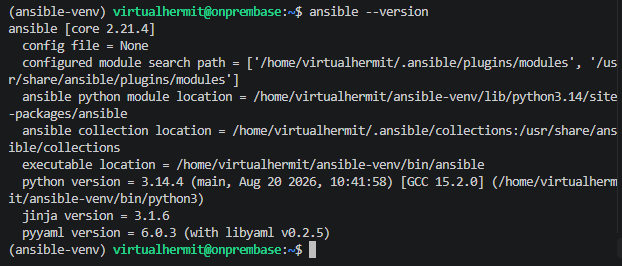
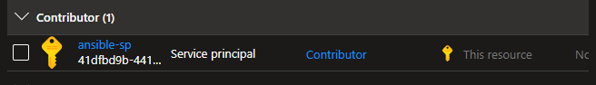
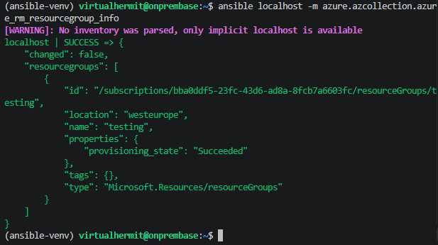

## Setting up Ansible

Wanted to cross off my current tool stack setup so ansible was naturally next.

The goal with ansible for me is to have it as control node on my server managing azure resources via SSH using Azure dynamic inventory instead of a static hosts file since VMs are coming and going as i rebiuild labs/projects.

Used pip instead of apt since apts Ansible package is often versions behind and i wanted a recent version for the `azure.azcollection` later on.

Installed full Pythong package with `venv` module since both are needed to create isolated virtual env:

```bash
sudo apt install -y python3-full python3-venv
```

Then created self contained Python env in the `ansible-venv` folder in the home directory. Needed to have them seperate from the systems python that apt manages to avoid "externally-managed-environment" error.

```bash
python3 -m venv ~/ansible-venv
```

And actiaveted the env in the current shell which swapped `python`/`pip` cmdlets to point at the venvs copies instead of system ones.

```bash
source ~/ansible-venv/bin/activate
```

>Note! This only lasts per terminal session, if closed needs to be run again.

Now with pip pointing at the venv, installed ansible:

```bash
pip install ansible
```

Checked if it was installed:

```bash
ansible --version
```



Now that ansible was installed and verified i moved onto downloading the azure modules into `~/.ansible/collections/`:

```bash
ansible-galaxy collection install azure.azcollection
```

And installed req file listing Azure Python SDKs it would actually call for under the hood, installing them into venv lets modules execute API calls against Azure:

```bash
pip install -r ~/ansible-venv/lib/python3.14/site-packages/ansible_collections/azure/azcollection/requirements.txt
```

Then created service principal on Azure, credential Ansible would authenticate with. 

Scoped it to entire subscription where im running labs/tests etc since scoping it to RG is rendered useless because i have mutiple of them for seperation of resources:

```bash
az ad sp create-for-rbac \
--name "ansible-sp" \
--role Contributor
--scopes //subscriptions/My_Subscription_ID
```



Now i needed to give the credentials to ansible on the server so the AZ modules could authenticate. By default it looks for credentials under `~/.azure/credentials`.

Created a folder for Azure:

```bash 
mkdir -p ~/.azure
```

Edited credentials file `nano ~/.azure/credentials` and added following:

```ini
[default]
subscription_id=<subscriptionID>
client_id=<appID>
secret=<password>
tenant=<tenant>
```

Obviously im not gonna post the actual values here. Anyway with that saved i locked down the file permissions so only my user could read it:

```bash
chmod 600 ~/.azure/credentials
```

Verified the credentials were actually working via ad-hoc ansible commmand, but before that created an empty RG to verify it worked:

```bash
ansible localhost -m azure.azcollection.azure_rm_resourcegroup_info
```

