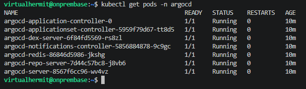
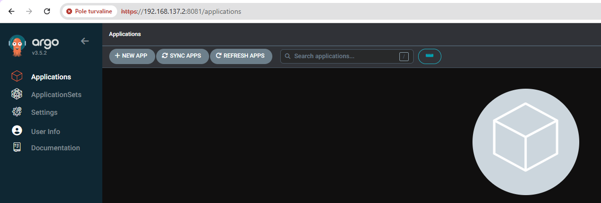

## Idea

Had an idea about creating a landing page for myself finally, clean HTTPS urls for the homelab instead of port remembering but instead of doing it in a simple manner like just installing Caddy my idea was to do it the way real Kubernetes clusters actually solve the problem using ingress, cert manager and ArgoCD for GitOps on top.

Full pieces and how they connect:

1. Ingress + Traefik: K3s already ship with built in Traefik as ingress controller, instead of seperate proxy container i would define K3s ingress resources that would tell Traefik to route to clean names instead of ports.

2. Cert manager: Handles HTTPS automatically, since i dont have public domain i would use local Certificate authority to usse certs my own devices would trust instead of browser showing "insecure" warnings.

3. Pi-hole local DNS entries: Pi hole already is my current DNS resolver so i would need to add custom records so services would actually resolve to the servers IP for any device on the network.

4. Homepage or Homarr: landing page sitting at the root URL showing tiles for every service as well as pulling live stats from services.

5. ArgoCD: Instead of manually running `kubectl apply` every time i would add or change 1 of these ingress manifests id push yml to Github and ArgoCD would automatically detect change and apply it to the cluster for me. Essentially more practice for GitOps. 

Considered poinging ArgoCD at gitea instead since its self hosted but it only pulls mirrors from GitHub on an interval so it would add real delay between pushing and seeing it deployed. GitHub would stay the source of truth ArgoCD would watch directly and Gitea remains just a backup mirror.

### Setting up ArgoCD

But before i could start doing all that i needed to setup ArgoCD first.

First created a namespace for it then applied the official manifest:

```bash
kubectl apply -n argocd --server-side --force-conflicts -f https://raw.githubusercontent.com/argoproj/argo-cd/stable/manifests/install.yaml
```

Then waited til ready pods conditions was met by running:

```bash
kubectl wait \
--for=condition=Ready pods \
--all -n argocd \
--timeout=600s
```

And checked whether argocd pods were now running:

```bash
kubectl get pods -n argocd
```


 
Decoded initial admin pw and login (same pattern as i did with pihole exporters app pw).

Then did quick port forwarding to confirm it was working:

```bash
kubectl port-forward svc/argocd-server -n argocd 8081:443
```

Which failed since port forwards default binding was local only, fixed it by explicitly telling it to bind to all interfaces not just localhost with:

```bash
kubectl port-forward svc/argocd-server -n argocd 8081:443 --address 0.0.0.0
```

Then checked the URL:



With that i had ArgoCD set up and could now start with the landing page idea.