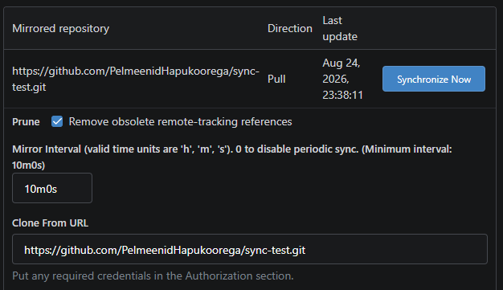
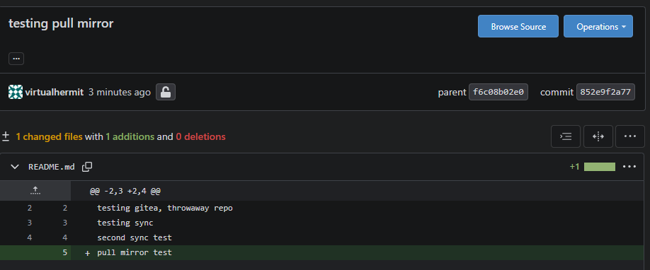

# GitHub Sync

Now that i had Gitea setup, i wanted to set up sync for my repos to store them locally so i could still have access to them whenever github was down and still work on them.

## Purpose

Considered push mirror at first because i thought if i were to make changes in gitea and then push to github it would automatically sync my repos and work, created test repository to see how it actually worked and learned that if i were to make changes on github and push from gitea it would overwrite my changes and it wasnt my inital goal.

My inital goal was to basically set up backup for my repos so i ended up with going with pull mirror and set the interval for 10 mins so that my repo would synced locally to gitea every 10 mins to minimize data loss if it ever were to occur.

# Build log: GitHub Sync

First created `sync-test` repo on GitHub and matching one in Gitea, at first as a regular repo and not a mirror. Cloned Githubs version locally then added Gitea as a 2nd remote, pushed it into Gitea manually.

Set up push mirror in Gitea pointing at Github, checked `sync when commits are pushed` (self explanatory), used default interval 8h > tested by pushing commit to Gitea, then confirmed it appeared on Github, appeared on Github within seconds despite the interval.

Edited README directly on github to see how it reacts and what would happen. 

Pushed another test commit to Gitea, push mirror succeeded again however it silently overwrote the manual Github edit instead of merging or erroring. Great example why i didnt test it with actual repos.

Confirmed it by checking Githubs actual README file content and the manual edit was gone. 

Decided that push mirror wasnt right for the actual goal i had in mind which was to use Gitea as a backup, switched to pull mirror instead. 

Deleted Gitea `sync-test` repo, tried recreating it through New Migration with the mirror checked. Then hit `The Git data underlying this repository cannot be read` error.

Retried migration the 2nd time and got the same error.

Checked `docker logs gitea` which basically told me that that repo didnt exist. Checked disk space, container user/permissions, also checked the wrong path `/data/gitea-repositories/` nothing existed there. Correct path turned out to be `/data/git/repositories/"myuser"/sync-test.git`.

Refreshed the Gitea repo page and the error was gone... It was a stale cahce problem and not a real failure, fml.

Anyway, set the mirror interval to 10 mins and pushed commit to Github normally, used sync now on gitea to force immediate pull to confirm change landed in Giteas copy, worked end to end.

Mirror settings with 10 min interval:

Commit landing:

Knowing the ins and outs of Gitea now, migrated all 4 of my main repos to Gitea as mirrors so now that when Github were to have an issue like they did 3 months ago where A LOOOT of code was just wiped from the database, i was safe.

## Takeaway

* Refresh the page instead of going down rabbitholes instantly
* push from Gitea overwrites files
* Push is irrelevant for my goal, it is unfortunate tho that there is no 2 way sync mirror with Gitea
* Gitea is useful if you are doing stuff solo, dealing with multiple people commiting to the same branch would be absolute mess and suicidal way of going about things