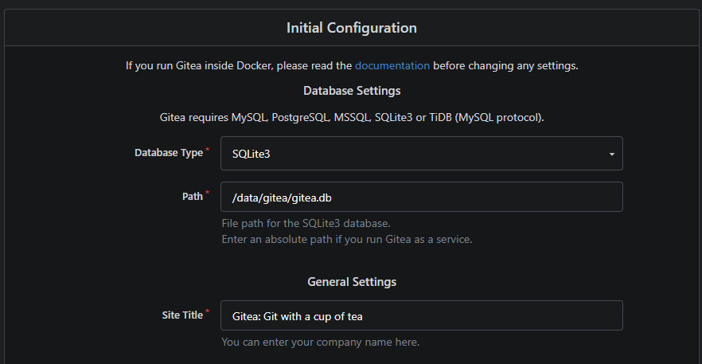
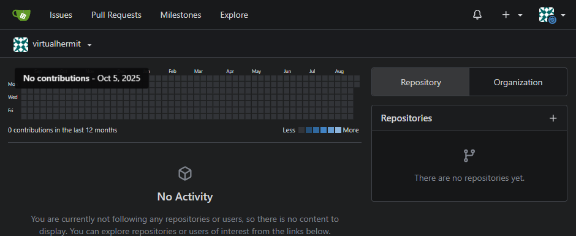

# Setup

Installing and configuring Gitea in Docker on the home lab laptop.

- Gitea running as a Docker container
- Web UI on port 3000
- SSH (git operations) on port 2222, 22 already used by the hosts own SSH
- Data persisted in a named Docker volume (`gitea-data`)

## Why these choices
- Docker over bare-metal install: consistent with the rest of this repos tooling, easy to tear down/rebuild
- Port 2222 instead of 22: avoids conflicting with the host SSH server used for remote management

# Build Log: Setting up Gitea

## Idea

I wanted to have a place where all my work could still be accessed and worked on in case GitHub went down, since its become a fairly somewhat regular occurence ever since Microsoft took over and most recently it was down for hours globally where work was literally halted until they fixed it including mine.

## Build

I ran

```bash
docker run -d \
  --name gitea \
  -p 3000:3000 \
  -p 2222:22 \
  -v gitea-data:/data \
  --restart=unless-stopped \
  gitea/gitea:latest
```

On the server to run gitea in a container and stored all the data safely outside the container so it would survive container restarts/rebuilds.

## Takeaway

Not really surprised by how it went, i mean i guess the question would be why 2222 and not something else? 22 was already taken by laptop itself so 2222 made sense as the next logical step.

This changes things in a sense that i will now be able to set up a sync of some kind, so that when i push my work to GitHub it would also push it locally on the server itself. Not sure if say GitHub is down, i could still make something in VSC and then push it on Gitea instead and then in return once GitHub is available it would automatically push the work on GitHub as well?

I guess ill find out.

## Screenshots

Initial config:


Dashboard after install:
