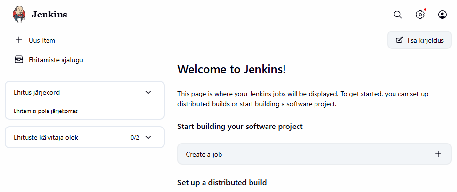

# Setup

Installing and configuring Jenkins in Docker on the home lab laptop.

* Jenkins running as Docker container
* Web UI on port 8081
* Agent communication port 50000 exposed for future use
* Data persisted in a named Docker volume (`jenkins-data`)

## Purpose

Wanted to get Jenkins running as the next step in learning CI/CD tooling itself, self hosted this time instead of GitHub Actions which ive already used. 

The idea is to eventually build a pipeline that lints/checks my Terraform on push similar to what my GitHub Actions workflow already does, but with a tool that a lot of DevOps job postings require so i wanted to start familiarising myself with it.

# Build log

Ran Jenkins in docker on the server:

```bash
docker run -d \
--name Jenkins \
-p 8081:8080 \
-p 50000:50000 \
-v jenkins-data:/var/jenkins_home \
--restart=unless-stopped \
jenkins/jenkins:lts
```

Jenkins web UI listens on port 8080 so why 8081 instead? Mapped it on 8081 to keep things tidy and avoid any future potential collisions if i were to add another tool that would want that port, same thing i did with Gitea.

Mounted it all on to named docker volume so it would survive even if the container gets deleted accidentally say or recreated again same as with Giteas `-v gitea-data:/data`.

Confirmed the container was running after installation with `docker ps` then opened it in browser with servers IP and 8081 port. 

What was interesting for me was that i was prompted for password which turned out Jenkins actually writes it to its volumes `/var/jenkins_home/secrets/initialAdminPassword` so i retrieved it from the folder and pasted in the UI then chose default Install plugins with no custom ones as of yet.

Created the Admin account after the plugins install with pw, email etc etc.

Left Jenkins URL same as it was prompted so base URL since its needs to be reachable and not be `"localhost"`

Landed on dashboard and it was GG WP.

## Takeaway

* Docker/volume/port pattern felt already familiar
* Nothing really that much noteworthy durin the setup and install, fairly straightforward and similar to Gitea, looking forward to actually start doing stuff with it so i can put genuine input in.

## Screenshot

