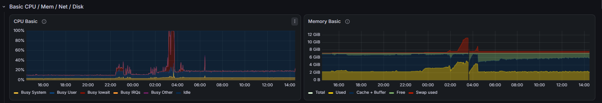
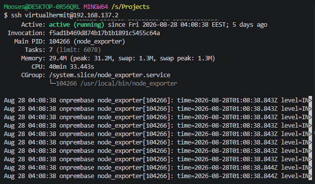
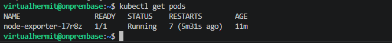
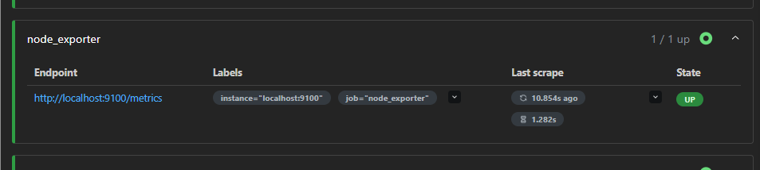

## Issue

So ive been messing around with my server recently quite a lot, self hosted a lot of things, set up grafana for example to be able to constantly monitor whats going on with the server. I added Cadvisor to the server so i could display grafanas dashboards on it as well since i needed a use case for my laptops screen and swtiching tabs on the workstation just wasnt efficient enough. Created a script for it as well so i can manually switch between dashboards as needed, at first had it auto switch each 60 seconds and when i was actually interacting with it, it would pause the switch countdown, however it got annoying so reverted back to manual switching.

Anyway few days ago i started noticing that the dashboard wasnt loading properly, server commands were taking forever, pi hole and prometheus scrapes failed so i checked grafana on the web since that was working fine: 



Now from this i knew that issue was with ram not being able to handle it since the laptop only has about 7Gbs of it.


After some investigation i realised that days earlier when i was setting up jenkins, i also messed around with my automation repo, specifically trying to run jobs on it to see how it worked before i eventually opted out of it because it was complicated for me to understand so i deleted the folders and small bits of documentation about it here as well as removing the docker container for it.

Or at least so i thought.

Ran `ps aux` which showed that jenkins java process was sitting at 101% CPU since 27th of August. 

Stopped the container and immediately the load dropped from 95 back to 2.5 which then fixed the issue.

However this prompted the next questions: What happens if i want to self host even more services with limited ram i had available? How can i minimize ram usage currently or even better, how can i run those services per resource and define CPU/RAM usage for each?

This led me to wanting to migrate my currently self hosted services to K3s instead since K3s explicitly lets me limit CPU/RAM per workload so this specific failure mode couldnt happen again.

## Build log


### Migrating node exporter

Now since K3s is still somewhat foreign territory for me i started with migrating node_exporter first because it has no persistent data, low risk and a good practice to learn K3s (K8s light pretty much).



Created manifests folder and then DaemonSet manifest to define node_exporter using host network so it would bind it directly to port 9100 and mount it `/proc` and `/sys` read only so it could read system stats.

Then defined resource requests and limits on the container spec so if it would say misbehave then K3s would enforce the cap on it instead of starving the host as it did with jenkins.

Then applied the manifest:

```bash
kubectl apply -f ~/k3s-manifests/node-exporter-daemonset.yaml
```

Checked around 1 min later if the pod was live:

```bash
kubectl get pods
```

Saw that it errored out so checked what was up:

```bash
kubectl describe pod node-exporter
```

Container state was terminated with exit code 1 and restart count at 5 so it was failing repeatedly and crashing instantly after starting.

Checked logs next:

```bash
kubectl logs node-exporter-l7r8z
```

Error:

`time=2026-09-02T23:25:49.223Z level=ERROR source=node_exporter.go:248 msg="listen tcp :9100: bind: address already in use"`


The issue was that the port was already in use because i forgot to stop the systemd service first. 

So first i stopped the systemd node_exporter:

```bash
sudo systemctl stop node_exporter
```

And then disabled it:

```bash
sudo systemctl disable node_exporter
```

Then waited for around 20 seconds before getting pod again and see if it flipped:



Ran curl on port 9100/metrics to make sure it was serving metrics and checked Prometheus targets page as well to make sure job was still UP:



