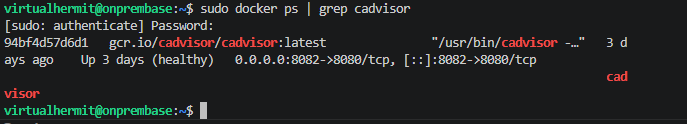
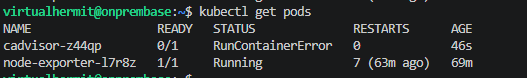
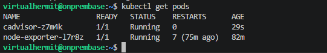
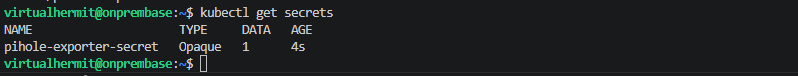
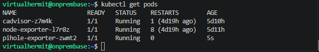
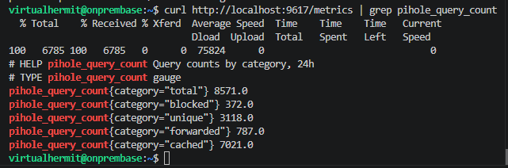
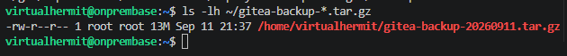
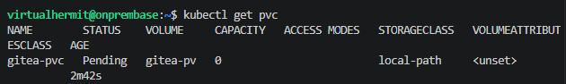
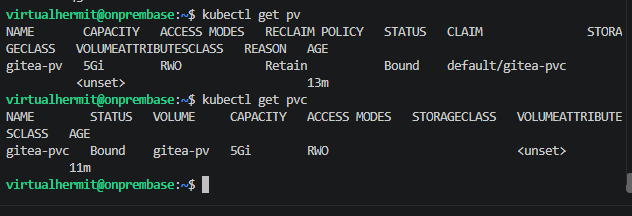
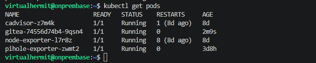

## Issue

So ive been messing around with my server recently quite a lot, self hosted a lot of things, set up grafana for example to be able to constantly monitor whats going on with the server. 

I added cAdvisor to the server so i could display grafanas dashboards on it as well since i needed a use case for my laptops screen and swtiching tabs on the workstation just wasnt efficient enough. 

Created a script for it as well so i can manually switch between dashboards as needed, at first had it auto switch each 60 seconds and when i was actually interacting with it, it would pause the switch countdown, however it got annoying so reverted back to manual switching.

Anyway few days ago i started noticing that the dashboard wasnt loading properly, server commands were taking forever, pi hole and prometheus scrapes failed so i checked grafana on the web since that was working fine: 


Now from this i knew that issue was with ram not being able to handle it since the laptop only has about 7Gbs of it.


After some investigation i realised that days earlier when i was setting up jenkins, i also messed around with my automation repo, specifically trying to run jobs on it to see how it worked before i eventually opted out of it because it was complicated for me to understand so i deleted the folders and small bits of documentation about it here as well as removing the docker container for it.

Or at least so i thought.

Ran `ps aux` which showed that jenkins java process was sitting at 101% CPU since 27th of August. 

Stopped the container and immediately the load dropped from 95 back to 2.5 which then fixed the issue.

However this prompted the next questions: What happens if i want to self host even more services with limited ram i had available? How can i minimize ram usage currently or even better, how can i run those services per resource and define CPU/RAM usage for each?

This led me to wanting to migrate my currently self hosted services to K3s instead since K3s explicitly lets me limit CPU/RAM per workload so this specific failure mode couldnt happen again.

## Build log


### Migrating node exporter

Now since K3s is still somewhat foreign territory for me i started with migrating node_exporter first because it has no persistent data, low risk and a good practice to learn K3s (K8s light pretty much).


Created manifests folder and then DaemonSet manifest to define node_exporter using host network so it would bind it directly to port 9100 and mount it `/proc` and `/sys` read only so it could read system stats.

Then defined resource requests and limits on the container spec so if it would say misbehave then K3s would enforce the cap on it instead of starving the host as it did with jenkins.

Then applied the manifest:

```bash
kubectl apply -f ~/k3s-manifests/node-exporter-daemonset.yaml
```

Checked around 1 min later if the pod was live:

```bash
kubectl get pods
```

Saw that it errored out so checked what was up:

```bash
kubectl describe pod node-exporter
```

Container state was terminated with exit code 1 and restart count at 5 so it was failing repeatedly and crashing instantly after starting.

Checked logs next:

```bash
kubectl logs node-exporter-l7r8z
```

Error:

`time=2026-09-02T23:25:49.223Z level=ERROR source=node_exporter.go:248 msg="listen tcp :9100: bind: address already in use"`


The issue was that the port was already in use because i forgot to stop the systemd service first. 

So first i stopped the systemd node_exporter:

```bash
sudo systemctl stop node_exporter
```

And then disabled it:

```bash
sudo systemctl disable node_exporter
```

Then waited for around 20 seconds before getting pod again and see if it flipped:


Ran curl on port 9100/metrics to make sure it was serving metrics and checked Prometheus targets page as well to make sure job was still UP:


### Migration cAdvisor

Used the same pattern as i did for node exporter with the exception of having 4 volume mounts in the manifest instead of 2 so:

* `/rootfs`: filesystem, read only so it could correlate container storage
* `/var/run`: Dockers socket/runtime state
* `/sys`: cgroup stats
* `/var/lib/docker`: Docker containers data

`hostNetwork: true` wasnt actually needed for the manifest for cadvisor since it only needs proc and sys volume mounts to see Dockers state, so for basic CPU/Memory metrics this was fine.



Also increased resource limits higher since cadvisor does more work than node exporter.

Stopped docker, applied the manifests and checked pods:



Checked logs on the pod which turned empty, then ran describe on cadvisor pod which showed:

```
 error mounting "/var/lib/kubelet/pods/64bd3590-848c-4d06-8fbd-838c38bd0b59/volumes/kubernetes.io~projected/kube-api-access-kpb9l" to rootfs at "/var/run/secrets/kubernetes.io/serviceaccount": create mountpoint for /var/run/secrets/kubernetes.io/serviceaccount mount: make mountpoint "/var/run/secrets/kubernetes.io/serviceaccount": mkdirat /run/k3s/containerd/io.containerd.runtime.v2.task/k8s.io/cadvisor/rootfs/run/secrets: read-only file system
```

Basically K8s tried to mount small API access token into every pod at `/var/run/secrets/kubernetes.io/serviceaccount` and i was trying to seperately mount the entire host to `/var/run` directory into the same containers `/var/run` and because my mount was read only and covered the same path, it coultn create its token mounpoint there therefore collision and crash.

The fix was to tell the pod to not bother injecting the token at all, so edited the yml and added `automountServiceAccountToken: false` under specs.

Saved the manifest and got pods again:



And verified it was up in prometheus as well.

cAdvisor was migrated too now.

### Migration Pihole


Used the same pattern here again with the exception being creating secret for pihole-exporter and secret being the app password because without it Piholes API couldnt fetch the metrics, same logic when i first self hosted it with docker.

```bash
kubectl create secret generic pihole-exporter-secret \
--from-literal=app-password='PASSWORD_HERE'
```

Then checked if it was created:



Created the yaml and defined app password as env variable (`PIHOLE_APP_PASSWORD`) sourced from the secret so the actual value wouldnt appear in the file itself.

Referenced it inside `args` list using `$(VARIABLE_NAME)` since pihole-exporter supports standard `-k` flag and no env variable but 

Kubernetes bridges that by substituting env vars value into `args` at container startup.

Next stopped docker for pihole-exporter, applied the manifest and looked at pods:



Checked if it was pulling metrics:

```bash
curl http://localhost:9617/metrics | grep pihole_query_count
```



### Migration Gitea

With gitea the migration would need to be different since it already holds meaningful data from all 4 of my repos and is synced.

Backed up Giteas current data first before handling the migration. 

Checked where dockers volume was currently storing the data with:

```bash
sudo docker inspect gitea | grep -A 5 "Mounts"
```

Confirmed it was living `gitea-data` docker volume and was physically stored at `/var/lib/docker/volumes/gitea-data/_data`.

Backed it up:

```bash
sudo tar -czvf ~/gitea-backup-$(date +%Y%m%d).tar.gz -C /var/lib/docker/volumes/gitea-data/_data .
```

Then verified the backup actually had content:

```bash
ls -lh ~/gitea-backup-*.tar.gz
```



Moved onto setting up persistent storage properly for the K3s version.

Created clean and dedicated location for Giteas K3s data which would be seperate from Dockers old volume:

```bash
sudo mkdir -p /mnt/k3s-data/gitea
```

Then changed ownership k3s-data to make UID 1000 owner of every file in the directory so giteas containerized process could read and write its own data once it was mounted.

```bash
sudo chown -R 1000:1000 /mnt/k3s-data/gitea
```

Restored backup into the new location:

```bash
sudo tar -xzvf ~/gitea-backup-$(date +%Y%m%d).tar.gz -C /mnt/k3s-data/gitea
```

And created the manifest where i defined persistent volume or PV and persistent volume claim aka PVC.

So PV the real 5Gb of disk space at `/mnt/k3s-data/gitea` and PVC the request actual request a pod for that storage.

Kubernetes keeps these seperate on purpose and i needed both because pods only ever reference a PVC and not PV directly, seperating "what storage exists" from "what an app asks for" so the same manifest would work no matter how the storage would be provisioned underneath.

PVC got stuck on `Pending` because K3s auto assigned its default `local-path` StorageClass to any PVC that doesnt explicitly opt out which didnt match the PVs own and unset storage class.



Fixed it by adding `storageClassName: ""` under PVC spec line in the yml.

Hit second error by trying to fix the first one and realised that once PVC is created its immutable and therefore cant be edited.

Deleted the old and recreated the PVC rather than patch it.

Checked if both PV and PVC showed `Bound` now:



Then created the deployment manifest for gitea.

Added `kind: Deployment`, `replicas: 1` since i only needed just 1 instance of Gitea, no use running multiple copies writing the same data.

Then `volumeMounts`/`volumes` referencing the PVC which would connect the pod to persistent storage. 

Also added `type: NodePort` to make it reachable on a fixed port on the servers real IP, similar to `hostNetwork` but recommended way for non DaemonSet workloads.

Applied the manifest then checked pods:



Then checked gitea itself and verified my data was intact and migration was success and stopped giteas docker container.

