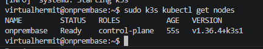
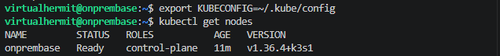
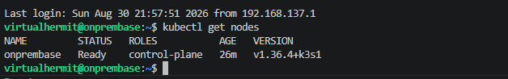

## Setup

Having some familiarity with K8s but clearly not enough i looked into K3s instead and figured id install them on my server to actually learn K3s first since its lightweight and my shitty laptop could actually handle it. The entire idea is to understand K3s first because i could interact with it without putting down huge sums of money and genuinely have it running if needed and it also directly builds on K8s as well.

## Installing K3s

Downloaded and ran K3s official install script with

```bash
curl -sfL https://get.k3s.io | sh -
```

The script grabbed latest stable binary and instantly set it up as systemd service and starts as a single node cluster where my server would act as both as the control plane and the only worker node. 

Verified it was then running and checked if the cluster was up with:

```bash
sudo k3s kubectl get nodes
```



Set up kubeconfig so plain `kubectl` would work without `sudo` or `k3s` prefixes.

First created `.kube` folder in the home directory using `-p` hyphen so it wouldnt error out if it was already there.

Copied K3s actual cluster config file to that folder and renamed it to `config` since kubectl looks for exactly `~/.kube/config` by default.

Because i made the copy with sudo then `~/.kube/config` also ended up owned by root so noram user account couldnt read it without `sudo` every time, changed ownership to self and used `$(id -u)` and `$(id -g)` to print my users UID and GID respectively so it would dynamically set ownership to whoever were to run the command instead of hardcoding username.

Tried to get nodes after and ran into an error where it failed to load the config file `/etc/rancher/k3s/k3s.yaml` because permission denied.

So it essentially ignored `~/.kube/config` entirely and defaulted to `/etc/rancher/k3s/k3s.yaml`

Set the `KUBECONFIG` env variable to point it at the copy instead:

```bash
export KUBECONFIG=~/.kube/config
```

Then ran `kubectl get nodes` to see if it worked:



Then made it permanent by adding it to `.bashrc` so i wouldnt have to set it again every session:

```bash
echo 'export KUBECONFIG=~/.kube/config' >> ~/.bashrc
```

and reloaded:

```bash
source ~/.bashrc
```

Then tested again by closing ssh session and running `kubectl get nodes` fresh:



Setup now complete.