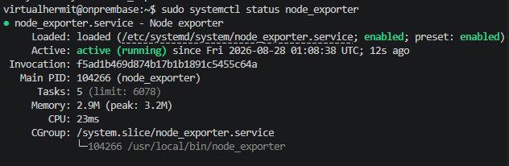
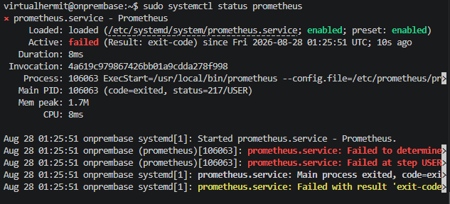
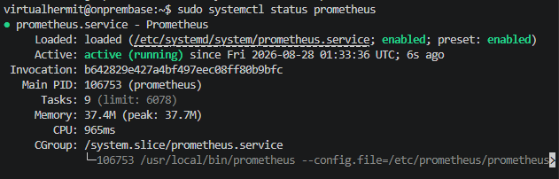
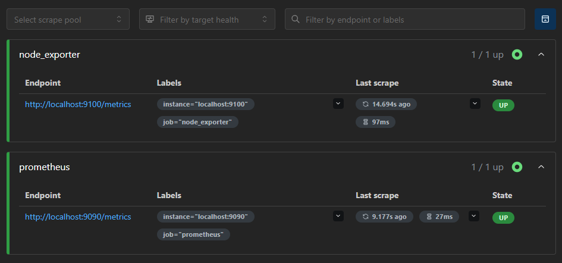
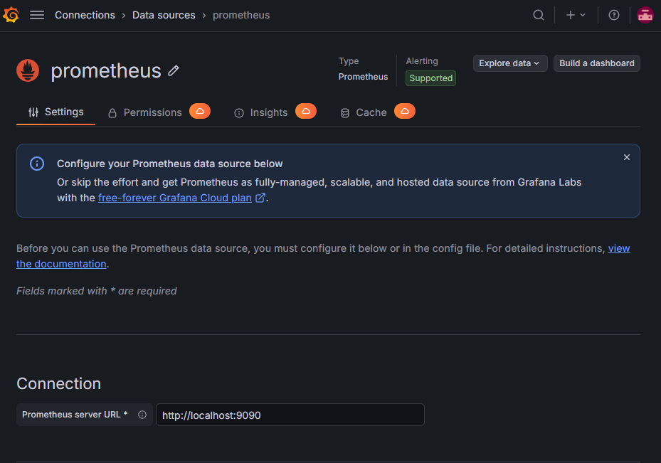
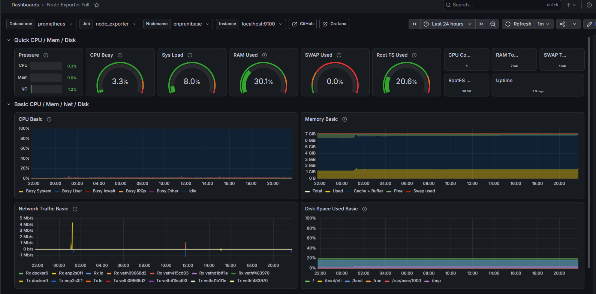
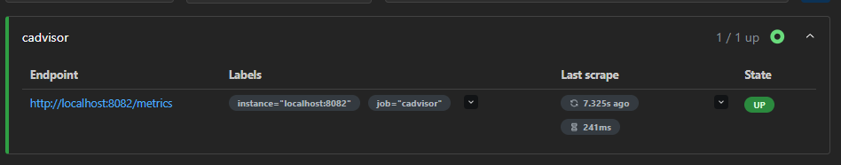
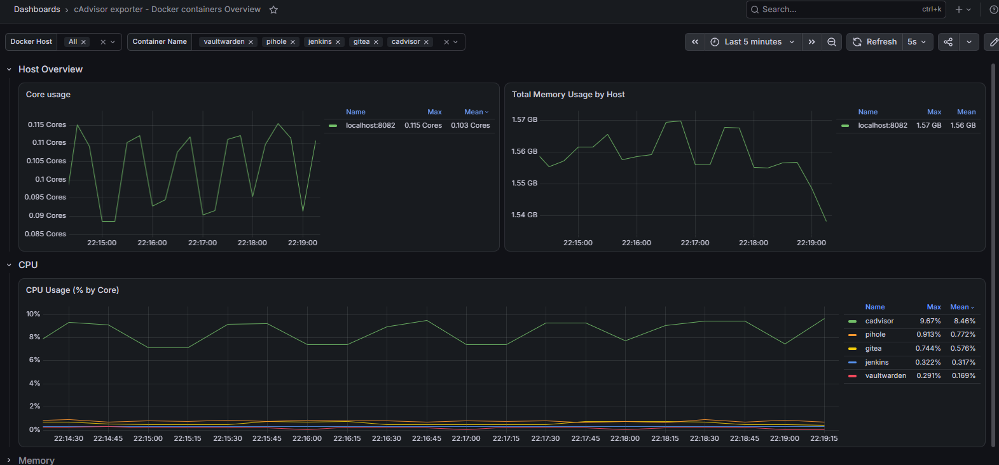

## Setup

Started to think about my home server what i was running on a laptop and wanted to make use of laptops display, then figured since my main interest is cloud and infrastructure i might as well self host grafana and prometheus on it so i could monitor my infrastructure deployments and everything else in real time and get some good practice in. 

Installed node exporter to temp folder before moving it later to local bin.

```bash
cd /tmp
```

node_exporter installation:

```bash
wget https://github.com/prometheus/node_exporter/releases/download/v1.12.1/node_exporter-1.12.1.linux-amd64.tar.gz
```

packaged it into an archive:

```bash
tar xvf node_exporter-1.12.1.linux-amd64.tar.gz
```

Moved it to `/usr/local/bin`:

```bash
sudo mv node_exporter-1.12.1.linux-amd64/node_exporter /usr/local/bin/
```

Then i created a dedicated user for running the service following best practices so non root user/no login user because if node exporter were to have a vulnerability then the attacker would be in an account where they couldnt do much due to it not having no home directory, no shell and no login either.

```bash 
sudo useradd --no-create-home --shell /usr/sbin/nologin node_exporter
```

Set the ownership on the binary next:

```bash
sudo chown node_exporter:node_exporter /usr/local/bin/node_exporter
```

Created the systemd service file:

```bash
sudo nano /etc/systemd/system/node_exporter.service
```

and added the following in the file:

```ini
[Unit]
Description=Node exporter
After=network.target

[Service]
User=node_exporter
Group=node_exporter
Type=simple
ExecStart=/usr/local/bin/node_exporter

[Install]
WantedBy=multi-user.target
```

Basically ordering it to not start before networking is up to avoid incomplete or not yet ready network state, defined it to run as restricted account i just made and make it start up automatically at normal boot just like other services ive set up before.

Reloaded daemon for the system to now recognise edited file, enabled node exporter and verified its status:



## Installing Prometheus

Next installed Prometheus using same pattern as with node exporter so download > extract > move binaries > creating dedicated user.

After all that created service file for Prometheus:

```ini
[Unit]
Description=Prometheus
After=network.target

[Service]
User=Prometheus
Group=Prometheus
Type=simple
ExecStart=/usr/local/bin/prometheus \
    --config.file=/etc/prometheus/prometheus.yml \
    --storage.tsdb.path=/var/lib/prometheus/

[Install]
WantedBy=multi-user.target
```

Pretty much the same as with node exporter except `--config.file` which tells Prometheus where its configuration lives and `--storage.tsdb.path` which tells it where to write actual time series database on the disk.

Saved the config, reloaded daemon, enabled it and verified:



### Troubleshooting: User case mismatch

Ran into an error instead, it couldnt switch to the prometheus user to run the process, yet config was fine so that wasnt the issue, user permissions problem was probably at the OS level.

Checked whether the user existed correctly with `id prometheus`, no issues there. 

Checked config again if i was hallucinating, turns out i was because i had capitalized "P" for prometheus under both User and Group and usernames are case sensitive so systemd was looking for a user "Prometheus" that didnt exist.

Fixed that in the config, reloaded daemon, restarted prometheus and checked status again:



### Configuring scrape jobs

Added second job for `node_exporter` with `scrape_configs` essentially telling Prometheus to also pull metrics from localhost on node_exporters port `9100`.

Saved config and restarted prometheus, was met with config error, added 2nd `scrape_configs` to the yml without noticing the first one, fixed that. 

Used `promtool` to verify config after edit by running `promtool check config /etc/prometheus/prometheus.yml`.

Then restarted prometheus, checked its status and then Targets page for scrape jobs:



## Installing Grafana

Moved to Grafanas installation so installed the prerequisites for it and added APT repo and created golder to hold trusted keys in `/etc/apt/keyrings/`.

Chain downloaded grafanas signing key and converted it into format apt could then use to verify packages are Grafanas.

```bash
wget -q -O - https://apt.grafana.com/gpg.key | gpg --dearmor | sudo tee /etc/apt/keyrings/grafana.gpg > /dev/null
```

Then registered the repo and went for install. 

Enabled grafana:

```bash
sudo systemctl enable --now grafana-server
```

Then verified its status was now active but before checking the page for it for inital login i needed change the default port in the `.ini` file for grafana to 3001 since port 3000 was where Gitea was running on my server.

Restarted grafana server and tried to accessed it. Next i wanted to add Prometheus as data source to make the dashboard so went to Connections > Data sources > Add data source, searched for Prometheus to add my config for it however to my surprise i just had the install button which was unusual since it was supposed to be bundled plugin and there was no place where i could add the config file. 

### Troubleshooting: Missing Prometheus plugin

Tried the install, figured that perhaps then i could find the place where i could add the config but nope, just data source not found page instead.

Checked `/etc/grafana/provisioning/datasources/` for conflictiong provisioning file and found only commented out `sample.yaml` so ruled that out.

Checked Grafanas logs on the server and found the actual error that read `Could not find plugin definition for data source" datasource_type=prometheus`.

Then checked `/usr/share/grafana/public/app/plugins/datasource/` directly and confirmed that there was no prometheus folder there at all unlike other sources.

Purged it fully and reinstalled grafana package again to rule out corrupted install and still hit the same result.

Researched the error and found this is a known change in recent grafana 13.x versions where some core data sources like Prometheus or Elasticsearch etc were externalized so no longer bundled in the binary and instead auto installed from grafana.com plugin API on first use.

Tested connectivity to that plugin API directly with `curl https://grafana.com/api/plugins/prometheus/versions` returned valid version and download beta so it worked fine and ruled out network block.

Checked logs for any background install attempt and found none so Grafanas automatic install flow just wasnt triggering.

Pivoted to download manually and try to drop the plugin into place myself rather than relying on Grafanas auto install.

So basically used the same method i used for Jenkins and Gitea. Downloading to `/tmp` folder, make plugins folder and unzip prometheus in it.

Fixed ownership for it so Grafana would run as its own dedicated user:

```bash
sudo chown -R grafana:grafana /var/lib/grafana/plugins
```

Then restart grafana server and listed plugins to see if prometheus folder now existed:

```bash
sudo systemctl restart grafana-server
```

```bash
sudo ls /var/lib/grafana/plugins/
```

Prometheus now showed up under plugins, checked grafana servers status and went to Grafana to see if i could now access Prometheus settings there and add connection URL to it:



## Dashboard adding

Now i had node_exporter, prometheus and grafana all working as a pipeline before i could move on to creating dashboard to monitor my homelab.

Since i already had node exporter configured i just imported Node exporter full dashboard with ID code 1860 and loaded that:



Next i wanted a dashboard for docker so i could see system status and containers, used `gcr.io/cadvisor/cadvisor` over the old `google/cadvisor` which runs as its own Docker container needing read only access to several host paths to see what i wanted to see:

Ran it:

```bash
sudo docker run \
--volume=/:/rootfs:ro \
--volume=/var/run:/var/run:ro \
--volume=/sys:/sys:ro \
--volume=/var/lib/docker/:/var/lib/docker:ro \
--volume=/dev/disk/:/dev/disk:ro \
--publish=8082:8080 \
--detach=true \
--name=cadvisor \
--restart=unless-stopped \
gcr.io/cadvisor/cadvisor:latest
```

Verified it was exposing metrics and added it to Prometheus as a scrape job by editing Prometheus yaml and adding new job:

```yaml
- job_name: "cadvisor"
  static_configs:
    - targets: ["localhost:8082"]
```

saved config and ran promtool check on config then restarted prometheus.

Checked prometheus targets to see if cadvisor was now added as a scrape job:



Went to Grafana and imported dashboard for cAdvisor which is actively maintained with ID 21743


